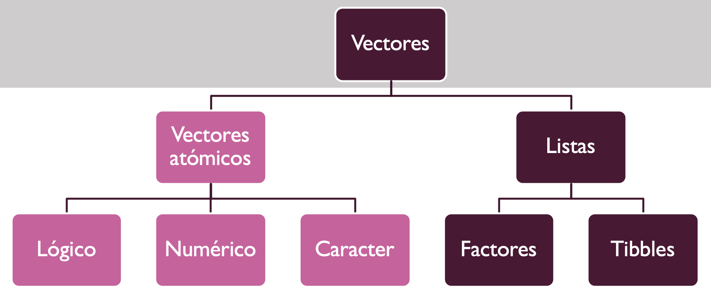
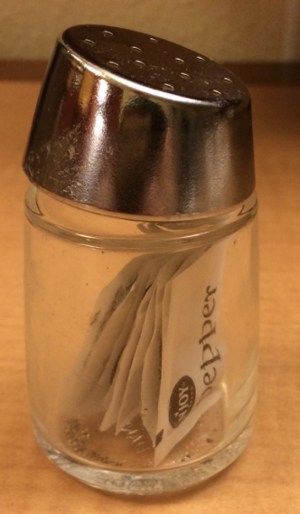
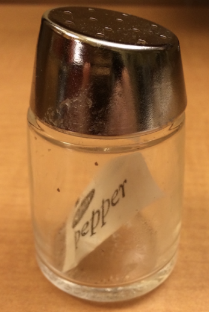
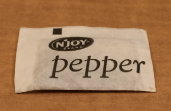
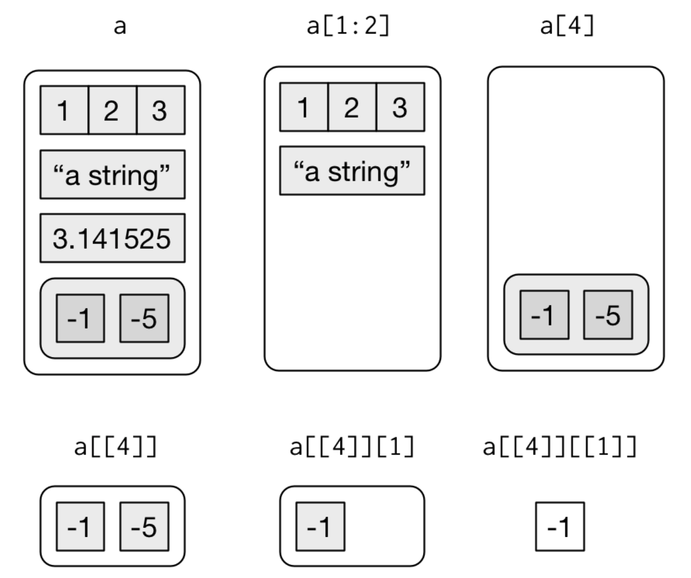

layout: true
  
<div class="my-footer"><span>

</span></div> 

```{r setup, include=FALSE}
#options(htmltools.dir.version = FALSE)

knitr::opts_chunk$set(fig.align = "center", out.width = "100%",
                      message = FALSE,
                      warning = FALSE)
```


```{r include=FALSE}
install.packages(c("DiagrammeR", "here", "knitr", "purrr", "tidyverse", "xaringan", "devtools"))
library(tidyverse)
library(purrr)
library(DiagrammeR)
devtools::install_github('yihui/xaringan')
```

---
class:

# ¿Qué vamos a ver hoy?

```{r echo=FALSE}

```

---
class:
## Vectores atómicos
Para los vectores utilizamos el comando `c( )`.

1. __Lógico__
  - Operadores de comparación
  - `FALSE`, `TRUE`, `NA`
  
2. __Numérico__
  - Incluye a los dobles y enteros
  - Los números dobles son aproximaciones `dplyr::near()`
  
3. __Caracter__
  - Cada elemento es un string 
  
  
---
class:

### Herramientas para vectores atómicos
1. __Coerción__: convertir un vector a otro

	1.1 __Coerción explícita__ los comandos que podemos usar son los siguientes: `as.logical()`, `as.integer()`, `as.double()`, `as.character()`
	  
	1.2 __Coerción implícita__: uso de un vector que se espera de otro tipo

2. 	__Funciones de Prueba__ cuando las cosas que queremos dependen del tipo de vector. Los comandos que podemos usar son los siguientes: `is_logical()`, `is_integer()`, `is_double()`, `is_character()`	,	`is_numeric()`,	`is_atomic()`, `is_list()`,	`is_vector()`

3. __Escalares y reglas de reciclado__ El vector de menor longitud se repite hasta igualar al vector más largo.

4. __Nombrar vectores__: a los vectores les puedo asignar un nombre. Podemos usar los siguientes comandos: `purrr::set_names()`, `c()`
  
5. __Creación de subconjuntos__ : antes usabamos `dplyr::filter`, pero ahora trabajaremos con `[ ]` **Q**: ¿cómo podemos crear un subconjunto de un vector? **R**: Vector numérico `c(2, 3, 5)`, Vector Lógico `is.na()`, Vector con nombre `c(“name1”)`, Vacío `[ ]`

---
class:
####Ejemplo: R Ladies en las Vegas
Ana y Beatriz jugaron al tragamonedas, ¿qué tal les fue?


```{r echo=FALSE, out.width="40%"}
knitr::include_graphics("https://www.diariodemorelos.com/noticias/sites/default/files/field/image/Econom%C3%ADa%20de%20Las%20Vegas%20se%20hunde%20tras%20cancelación%20de%20espectáculos.jpeg")
```

```{r}
A <- c(140, -50, 20, -120, 240) #Ana
B <- c(-24, -50, 100, -350, 10) #Beatriz
```
######Usando *Herramienta para vectores atómicos* : *Funciones de prueba*
```{r eval=FALSE, include=TRUE}
is.vector(B) # TRUE
```

######Usando *Herramienta para vectores atómicos* : *Coerción explícita*
```{r eval=FALSE, include=TRUE}
typeof(A) #"double"
A_integer <- c(140L, -50L, 20L, -120L, 240L)
typeof(A_integer) #"integer"
typeof(as.double(A_integer))#"double"
```


---
class:
####Ejemplo: R Ladies en las Vegas
Hubo alguien Desconocido fuera de Rladies que nos comunicó sus resultados en el juego.

######Usando *Herramienta para vectores atómicos* : *Creación de subconjuntos con vector lógico*
```{r}
D <- c(-14, NA, -100, NA, -560) #Desconocido
(D[!is.na(D)]) 
```
---
class:
####Ejemplo: R Ladies en las Vegas

El team Rladies estuvo en las Vegas toda la semana.

```{r}
names(A) <- c("Monday", "Tuesday", "Wednesday", "Thursday", "Friday")
names(B)<- c("Monday", "Tuesday", "Wednesday", "Thursday", "Friday")
```
######Usando *Herramienta para vectores atómicos*: *nombrar: vectores*
```{r eval=FALSE, include=TRUE}
set_names(A, c("Monday", "Tuesday", "Wednesday", "Thursday", "Friday"))
```

```{r}
days_vector <- c("Monday", "Tuesday", "Wednesday", "Thursday", "Friday")
names(A) <-   days_vector 
names(B) <- days_vector
(A)
```

---
class:
####Ejemplo: R Ladies en las Vegas
¿Estarán Perdiendo dinero?, ¿quién está perdiendo más dinero?
```{r}
dinero_A <- sum(A) # 230
dinero_B <- sum(B) #-314
(dinero_A > dinero_B)
```
Ana está ganando dinero. Pero, ¿qué días Ana obtuvo resultados positivos en la ruleta?

######Usando *Herramienta para vectores atómicos* : *regla de reciclado*
```{r}
selection_A <- A > 0 
```

```{r}
selection_A <- A > rep(0, length(A)) #(No usamos mucho reciclado)
#(selection_A <- A > c(0,0) #Error!! Horror!! par no compatible con impar
(selection_A <- A > c(0))
```

```{r eval=FALSE, include=TRUE}
typeof(selection_A) #logical
```
---
class:
####Ejemplo: R Ladies en las Vegas

Ana ganó los días Lunes, Miércoles y Viernes
```{r}
(A_dias_ganadores <- A[selection_A])
```

---
class:
###Ejemplo: Mis calificaciones en la universidad...


```{r}
notas <- c(1.8, 6.2, 6.1, 5.5, 7.0, 6.8, 4.0, 4.5, 3.8, 6.7)
```
######Usando *Herramienta para vectores atómicos* : *Creación de subconjuntos con vector numérico*

Con estas calificaciones presumo.
```{r}
(notas[c(2,5,6)])
```

Las calificaciones que le muestro a mi Mami (mentira)
```{r}
(notas[c(-1, -9)])
#notas[c(-1, 2)]#Es un Horror mezclar valores positivos y negativos!!
```

El promedio que me encantaría tener
```{r eval=FALSE, include=TRUE}
notas[5] # 7
```

---
class:
#Listas
Una lista en R es similar a su lista de supermercado

- Distintos tipos
- Distintas características
- Largos diferentes

 **Lista** = __*Super Dato*__


---
class:
####Ejemplo: Mi lista de supermercado
```{r}
mi_vector <- c("cloro", "detergente")

mi_matriz <- matrix(2:5, nrow = 1, ncol=4)

dimnames(mi_matriz) = list( c("bolsas"), c("arroz", "lentejas", "porotos", "garbanzos")) 

mi_df     <- data.frame("Kilos" = 2:4, "Verdura" = c("papas", "tomate", "limones"))

mi_lista <- list("un_vector" = mi_vector, "una_matriz" = mi_matriz, "un_df" = mi_df)
```

```{r echo=FALSE, out.width="40%"}
knitr::include_graphics("https://i.blogs.es/0baa91/39f95492-38ee-4f16-92e1-ba5161f4a958/1366_2000.jpeg")
```

---
class:
####Ejemplo: Mi lista de supermercado

En una lista usamos `$` para nombrar la columna.

Vector : `un_vector[position]`.
```{r}
(mi_lista$un_vector[1])
```

Matriz `una_matriz[row.name, col.name]`.
```{r}
(mi_lista$una_matriz["bolsas", "lentejas"])
```

Data Frame : `un_df[row.index, column.index]`.
```{r}
(mi_lista$un_df[1:2,])
```

---
class:
####Ejemplo: Mi lista de supermercado
```{r}
(list_modify(mi_lista, un_vector = 5))
```
---
class:
####Ejemplo: Mi lista de supermercado
```{r}
(list_merge(mi_lista, un_vector = 11, mi_matriz=matrix(1:4, nrow = 2)))
```
---
class:
####Ejemplo: Mi lista de supermercado

Me faltó agregar la pimienta a la lista del supermercado!
.pull-left[
`x`

```{r echo=FALSE, out.width="20%"}

```

`x[1]`

```{r echo=FALSE, out.width="20%"}

```
]

.pull-right[
`x[[1]]`

```{r echo=FALSE, out.width="50%"}

```

`x[[1]][[1]]`

```{r echo=FALSE, out.width="50%"}
knitr::include_graphics("img/4.png")
```
]
---
class:

###¿Cómo se realiza un diagrama de una lista?

[DiagrammeR](http://rich-iannone.github.io/DiagrammeR/graphviz_and_mermaid.html) [Graphviz](https://www.graphviz.org/).
El diagrama de la lista
`list(a, b, list(c, d), list(e, f))`
es:

```{r echo=FALSE}
    file_nested_set_1 <- here::here("diagrams", "nested_set_1.dot")
    DiagrammeR::grViz(file_nested_set_1)
```

---
class:

###¿Cómo es el diagrama de una lista?
```{r echo=FALSE, out.width="55%"}

```

---
class:
#Factores
El término factor se refiere a un tipo de datos estadísticos utilizado para almacenar variables categóricas.

Una variable categórica puede ser:

  - __Nominal__: es una variable categórica sin un orden implícito. Esto significa que es imposible decir que *"uno vale más que el otro"*.
  
  - __Categórica ordinal__: tienen un orden natural.
  


---
class:

**Nominal**
```{r}
vector_animal <- c("Elefante", "Jirafa", "Perrito", "Chanchito")
(factor_vector_animal <- factor(vector_animal)) 
attributes(factor_vector_animal) 
```

---
class:

**Ordinal**

```{r}
vector_temperatura <- c("High", "Low", "High","Low", "Medium")
(factor_vector_temperatura <- factor(vector_temperatura, order = TRUE, levels = c("Low", "Medium", "High")))
```

¿Qué ocurre si pongo order = FALSE?

```{r}
(factor_vector_temperatura <- factor(vector_temperatura, order = FALSE, levels = c("Low", "Medium", "High")))
summary(factor_vector_temperatura)
```

---
class:
####Ejemplo Factor para ggplot

.pull-left[
```{r echo=TRUE, out.width="95%"}
ggplot(mtcars)+
  geom_point(aes(x=mpg, y=drat, colour=gear), size = 5)
```
]

.pull-right[
```{r echo=TRUE, out.width="95%"}
ggplot(mtcars)+
  geom_point(aes(x=mpg, y=drat, colour=factor(gear)), size = 5)
```
]

---
class:
#Data Frames

  - **Columnas**:  variables de un conjunto de datos.
  
  - **Filas**: observaciones.

  - Todos los elementos de un data frame deben ser vectores de la misma longitud


---
class:

###Ejemplo: Sistema planetario

```{r}
name <- c("Mercury", "Venus", "Earth", "Mars", "Jupiter", "Saturn", "Uranus", "Neptune")
type <- c("Terrestrial planet", "Terrestrial planet", "Terrestrial planet", 
          "Terrestrial planet", "Gas giant", "Gas giant", "Gas giant", "Gas giant")
diameter <- c(0.382, 0.949, 1, 0.532, 11.209, 9.449, 4.007, 3.883)
rotation <- c(58.64, -243.02, 1, 1.03, 0.41, 0.43, -0.72, 0.67)
rings <- c(FALSE, FALSE, FALSE, FALSE, TRUE, TRUE, TRUE, TRUE)

planets_df <- data.frame(name, type,diameter,rotation,rings )
str(planets_df)
```
```{r echo=FALSE, out.width="20%"}
knitr::include_graphics("https://live.staticflickr.com/7052/6960549021_c82b8babde_m.jpg")
```


---
class:
###Ejemplo: Sistema planetario

¿Cómo reorganizamos el data frame de modo que comience con el planeta más pequeño y termine con el más grande?

Primero generamos las posiciones
```{r}
(planets_df[1:5,"diameter"])
planets_df$diameter[1:5]
```
El orden según diametro es Mercurio, Martes, Venus, Tierra, Neptuno, Saturno, Jupiter.
```{r eval=FALSE, include=TRUE}
(positions <-  order(planets_df$diameter))
planets_df[positions,]
```

---
class:
# TIBBLES 

- Los tibbles tienen un método de impresión en la consola refinado: 
  - Solo muestran las primeras 10 filas 
  - Solo muestran las columnas que entran en el ancho de la pantalla.
  
- Útil con hartos datos.

- ¿ Tibble = Tittle + Table ?

- Además del nombre, cada columna muestra su tipo `str()`

---
class:
###Ejemplo sencillo Tibble
```{r}
df <- tibble(
  x = runif(5),
  y = rnorm(5)
)
df
```

```{r}
#Extraer ######Usando el nombre
df$x
df[["x"]]
df[[1]]
```


---
class:
##Observaciones

###Dplyr vs Base R
```{r }
head(iris)
```
---
class:
###Dplyr vs Base R
#### Tidyverse
```{r eval=FALSE, include=TRUE}
head(select(iris, Species, Petal.Width) )# by name: facil de reconocer
#head(select(iris, 5, 4) ) # by column index
```
####base R
```{r}
head(iris[, c("Species", "Petal.Width")] )# by name columas nombre
#iris[, c(5, 4)]  # by column index
```

---
class:
###Dplyr vs Base R
####tidyverse
```{r eval=FALSE, include=TRUE}

head(mutate(iris, 
       Petal.Ratio = Petal.Length/Petal.Width,
       Sepal.Ratio = Sepal.Length/Sepal.Width))
```
####base R
```{r}
iris$Petal.Ratio <- iris$Petal.Length/iris$Petal.Width
iris$Sepal.Ratio <- iris$Sepal.Length/iris$Sepal.Width
```
---
class:
###Dplyr vs Base R
####tidyverse
```{r eval=FALSE, include=TRUE}
filter(iris, Petal.Width > 0.5 & Species == "setosa")
```

#####base R
```{r}
iris[iris$Petal.Width > 0.5 & iris$Species == "setosa", ]
#head(subset(iris, Petal.Width > 0.5 & Species == "setosa"))
```

---
class:
###Dplyr vs Base R
####tidyverse
```{r eval=FALSE, include=TRUE}
arrange(iris, desc(Species), Petal.Width) 
```
####base R
```{r}
head(iris[order(rev(iris$Species), iris$Petal.Width) , ])
```


---
class:
##Teach Exam

##### Question 2
Elements of data structures in R can be indexed using single square brackets thing[index], double square brackets thing[[index]], or dollar signs thing$index. You are teaching an introductory workshop on R, and have just given examples of all three kinds of indexing.

2.1 Create a multiple choice question to test their understanding. Include one right answer and at least two wrong answers, and explain clearly what misconceptions the wrong answers are intended to diagnose.

2.2 Create a short fill-in-the-blanks coding exercise to test their ability to use all three kinds of indexing correctly. Provide the explanatory text you would give the learners and the template code they would fill in, and explain what answers you expect and what errors you expect learners to make.

---
class:
####Ejemplo pregunta selección múltiple

  - Rápida de revisar
  - Altamente usadas
  - Si son bien diseñadas, entregan información valiosa.

Ejemplo:

¿Cuánto es  37 + 15?:

a) 52

b) 42

c) 412

d) 43

La respuesta es **a)**

Si elige **b) 42** no entiende lo que significa "cargar". 

Si elige **c) 412**, está tratando cada columna de números como un problema separado. 

Si elige **d) 43**, entonces sabe que tiene que cargar el 1, pero lo está llevando de vuelta a la columna de la que proviene. 

---
class:

##### Question 2.1 Create a multiple choice question to test their understanding. Include one right answer and at least two wrong answers, and explain clearly what misconceptions the wrong answers are intended to diagnose.


__Pregunta__: ¿Qué valor retorna `thing[2]`, `thing[[2]]`, `thing$dos` cuando `thing <- c(uno = "2", dos= "4", tres= "6")`

  a) "4" con su atributo nombre dos, "4", Error
  
  b) "2", "2", dos
  
  c) "4", "4", Error
  
  d) "4" con su atributo nombre dos, "4", "4"
  
  e)  4, 4 con su atributo nombre dos, Error

---
class:

La respuesta correcta es la alternativa **a)**

Si elige **b)** es porque cree que lo que está al lado de thing es lo que retorna el valor, en ese caso no entiende bien el concepto general.

Si elige **c)** es porque no entiende que `[[ ]]` es usado para las listas y que lo que hace en un vector atómico es quitar el atributo nombre de la consola. Específicamente ` attributes(thing[2])` retorna `$names  "dos" ` pero `attributes(thing[[2])` retorna `NULL`.

Si elige **d)** es porque no recuerda que el símobolo `$` se utiliza para las listas y no vectores atómicos y por ende es un Error.

Si elige **e)** es porque no reconoce que las comillas `" "` indican a un caracter.


---
class:

##### Question 2.2 Create a short fill-in-the-blanks coding exercise to test their ability to use all three kinds of indexing correctly. Provide the explanatory text you would give the learners and the template code they would fill in, and explain what answers you expect and what errors you expect learners to make.

```{r}
Sirenita_list <- list( nombre_pelicula <- "La Sirenita", actores = c("Ariel", "Úrsula", "Sebastian", "Principe Eric", "Rey del mar") )

#Imprima el vector de los actores
#Sirenita_list$___

#Imprima el segundo elemento del vector que representa los actores
#Sirenita_list$___[]

# Use the table from the exercise to define the comments and scores vectors
notas <- c(7, 6.8, 6.7, 6.9, 7)
comentarios <- c("MI FAVORITA", "Inreíble!", "Me gusta, es buena", "De las mejores peliculas","La amo demasiado!!!!!!!!")

#Comprueba que el largo de las notas sea el mismo que el de los comentarios
#length(notas) ___ length(comentarios)

# Guarde el promedio de las notas en la variable promedio_notas 
#promedio_notas <- ____(notas)

# Combine las notas y comentarios en un data frame, llamelo nevaluaciones_df
#evaluaciones_df <- data.frame(____, ____)

# Crear e imprimir una lista con todos los vectores obtenidos llamale lista_total
#lista_total <- ___(nombre_pelicula, actores ,evaluaciones_df, promedio_notas)
#____________
```


